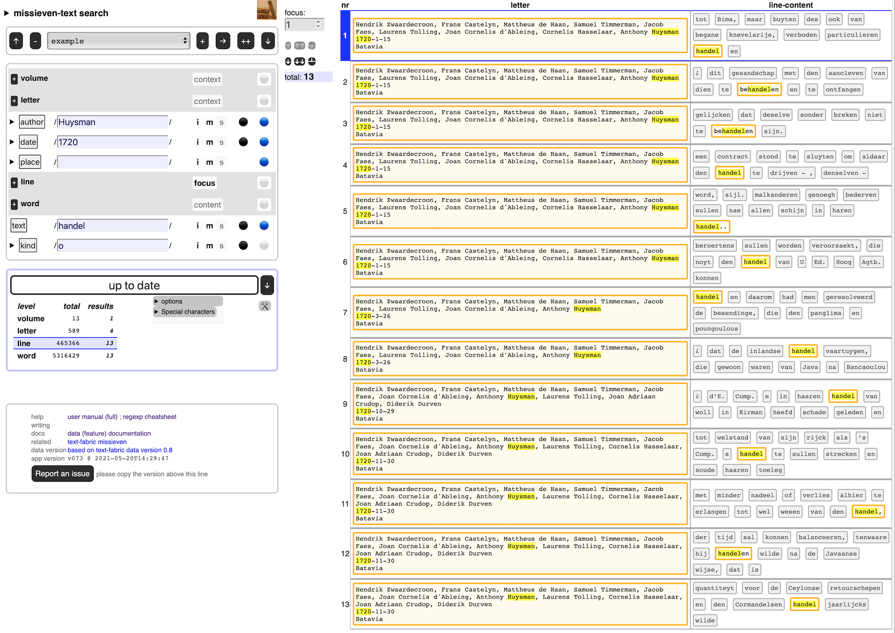

# General Missives

This is a
[Text-Fabric](https://github.com/annotation/text-fabric) app
for working with the
[General missives](https://github.com/Dans-labs/clariah-gm) corpus:
Letters between the governors of the Dutch East India Company and the government during 1600-1800.

Get started with the
[tutorial](https://nbviewer.jupyter.org/github/annotation/tutorials/blob/master/missieven/start.ipynb).

See also
[about](https://github.com/Dans-labs/clariah-gm),
[transcription](https://github.com/Nino-cunei/tfFromAtf/blob/master/docs/transcription.md).
[online representation by the HuygensING institute](http://resources.huygens.knaw.nl/retroboeken/generalemissiven/#page=0&accessor=toc&view=homePane)

# Search interface to-go

We have generated a search interface for the missieven from the Text-Fabric data.

Just click
[missieven-search](https://annotation.github.io/app-missieven/)
and off you go.

It is experimental.
You can do full text search via regular expressions, not only in the full-text,
but also in attributes of the text.

An example search is in [example.json](example.json).
Download the file, then import it in your search interface, and you see it happening.

The interface works completely inside your browser without consulting any server,
apart from first traveling from GitHub to your browser.

It is written in pure, modern Javascript.
The corpus is stored in a few javascript variables.

If you want to search completely of line, you can press a button to
download the complete package as a zipfile from within the app.

You can import and export search jobs as json files.
You can export search results as tab-separated files.

More info in the [manual](https://annotation.github.io/text-fabric/tf/about/clientmanual.html).

# Author

[Dirk Roorda](https://github.com/dirkroorda)

